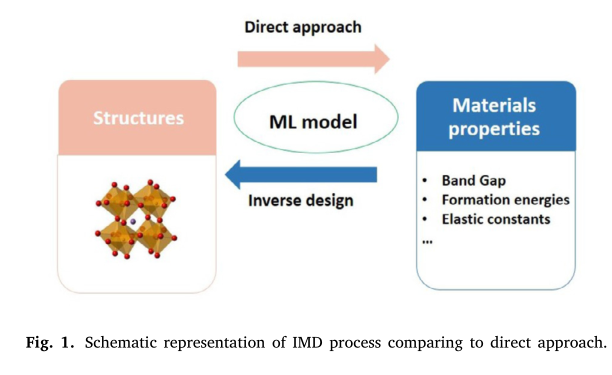

# Recent progress in generative adversarial networks applied to inversely designing inorganic materials: A brief review

生成对抗神经网络（GANs）可以生成全新的图像、文本、音乐和语音。最近有学者将GANs应用在“逆向材料开发（IMD）”上，取得了有趣的进展

## 逆向设计

* 传统方式：从结构出发，通过材料性质计算等方法得到结构

* 逆向设计：从所需材料的功能作为输入，识别出具有这种功能的新材料。设计策略可分为高通量虚拟筛选、全局优化和生成模型
  * 高通量虚拟筛选：基于直觉和密度泛函理论（DFT）或Hartree-Fock（HF）计算大量材料。训练预测模型，将成分映射到属性，组合筛选出不同的材料成分，并预测假设的候选材料
  * 全局优化：主要在导航化学空间方面有优势，如进化算法（EAs）、遗传算法（GAs）、粒子群优化和模拟退火
  * 生成模型：可解决上述方法中的大DFT计算或样本生成偏差问题，它可以处理基于化学或物理的信息，从而加速材料开发。

## 生成网络

​	生成式网络可以隐式地学习数据分布，可以使用几种ML算法来构建：GANs、变分自动编码器（VAEs）、RNN、强化学习（RL）及它们的变体。

​	经典的生成模型如图（a）所示，它使用生成器-判别器模型。生成器用于从低维随机噪声向量中生成虚假数据，判别器则用于区分真实和虚假数据，当它无法区分真实数据和虚假数据时，模型已经学习到了如何从真实数据中生成虚假数据，此时生成器终止学习。

​	条件GAN（CGANs）则是在生成真实和虚假样本时加入了条件约束，这使得它们可以扩展到跨领域学习。

​	Wasserstein GAN（WGAN）则时将判别器替换为了评分器，并通过最小化Wasserstein距离来优化模型。

## GANs用于发现新材料

* CrystalGAN——应用基于CycleGAN的策略来生成晶体结构
  * 目标：从观察到的A-H和B-H二元结构中生成新的三元金属杂化物（A-B-H相）
  * 模型输入：晶体几何矩阵和原子的离子位置
  * 做法：使用CycleGAN模型将一个氢化物系统映射到另一个氢化物系统上，以增加数据数量
    * 生成域混合的伪二进制样本
    * 构建比第一步更复杂的特征
    * 使用GAN在遵守几何限制的情况下预测三元稳定化合物
* GAN用于预测仅含有Mg、Mn和O原子的三元化合物
  * 模型输入：一组原子坐标和单元参数的二维矩阵表示
  * 特征构建：使用类似的基于坐标的表示，通过数据增强技术实现不变对称性和通过对称操作实现不变排列
  * 模型：包含一个生成器（用于生成表示），评分器和分类器，通过Wasserstein距离来优化模型
  * 结果：发现了23种适用于光阳极应用的晶体结构，但模型仅限于预测Mg-Mn-O结构
* MatGAN——使用具有特定属性的数据输入来预测化学上有效的假设材料
  * 模型：将生成器和判别器建模为深度神经网络（DNN），可预测200万种新材料，其中92.53%为新材料
* GMs还被用于发现材料结构、估计结构稳定性和材料合成性，预测结构性能
* constrained-crystal deep convolutional GAN (CCDCGAN)——将约束网络作为反向传播器集成到网络中
  * 优点：无需在输入中嵌入材料属性，从而自动优化生成器和预测器，比传统的GAN更快地生成稳定结构
  * 模型及应用：主要包含三维卷积层，应用于Bi-Se体系
* CubicGAN——基于DNN的GM模型，用于发现众多晶体结构
  * 数据集：仅使用立方空间群（Fm3m, F43m和Pm3m）
  * 特征构建：使用元素化学性质、坐标和空间群表示三元和四元化合物
  * 验证：使用Wasserstein距离作为损失函数，基于有效性、多样性和唯一性对预测结构有效性进行了研究，通过声子色散计算验证材料稳定性
  * 结果：发现了506种假设的原型材料结构
* CubicGAN的作者在损失函数中加入了物理损失（如距离单位细胞大小）从而更加有效地预期晶体结构

## 材料数据库

​	上表是通过实验或计算得出的数据库

​	上表是材料科学方面用于机器学习方面的相关工具

## 描述符

​	描述符主要用于将原始的材料数据映射到可以作为机器学习输入的形式。如Coulomb Matrices (CMs)、molecular graphs、smooth-overlap-of-atomic-positions （SOAP）atomic structures和bonds and angles ML （BAML）已被用于获取分子和原子结构。但晶体必须考虑晶格周期性和额外的空间群对称性。

在IMD中使用的各种描述符如上所示：

* （a）三维晶体结构表示方法（很罕见，因难以在latent space(潜在空间)获得连续表示，而且计算成本很高）
  * 沸石材料的立方体素三维网格，分别以紫色、红色和黄色表示甲烷势能、硅原子和氧原子
* （b）Simplified Molecular-Input Line-Entry System（SMILES）——将物理3D结构转换为矢量或符号字符串
  * 使用‘c’或‘C’分别表示芳香族和脂肪族碳原子，‘O’代表氧原子，‘-’、‘=’和‘#’分子分别表示单键、双键和三键
  * 每个化学式都有唯一的SMILES字符串，它里面使用了真实的语言结构，被广泛应用于分子预测，特别是用于训练GAN模型以发现药物
* （c）3D数据转换为2D描述符，用于描述晶格参数、原子位置、电子密度图和原子密度
  * Kim等人使用二维坐标表示原子坐标和晶胞信息
* （d）来源于“点云”，对象被表示为一组显示3D坐标的点和向量，再转换为2D表示
  * 将原子位置的体素网络和晶格常数与晶体图结合来预测二维晶体图，通过自编码器系统将决定晶体结构参数的体素空间编码成二维晶体图
  * 晶格常数和原子坐标分别转换为32x32x32和64x64x64维的体素空间，整个过程可逆，由此可形成一个连续的潜在空间
* （e）利用化学式构建成分的稀疏矩阵
  * 行和列分别表示分子中每个元素的原子数和数据中使用的化学元素的数量
  * 缺点：每个组合可能对应于多个结构阶段，描述符仅限于简单的化合物

## GAN应用未来的机遇和挑战

* 发现满足各种技术和经济限制的材料具有挑战性，再表征材料性质方面的进展优先，材料性质计算昂贵
* 已有学者使用数据增强技术来扩充数据集，即通过变换人为地增加可访问的训练数据的数据量。
* 定义转换结构—属性关系的描述符仍然具有挑战性。对于晶体结构的表征，必须研究对称性和周期性。
* GANs模型本身具有参数精细、收敛困难、不稳定等特点，尽管有使用Wasserstein距离来作为损失函数，但WGAN可能不稳定
* 缺乏可保和一致的指标，使得难以评估表现最好的GANs算法