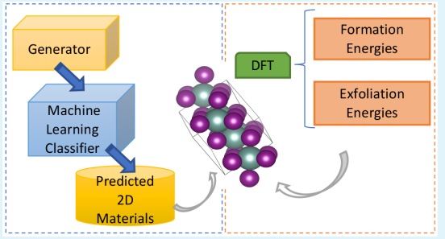
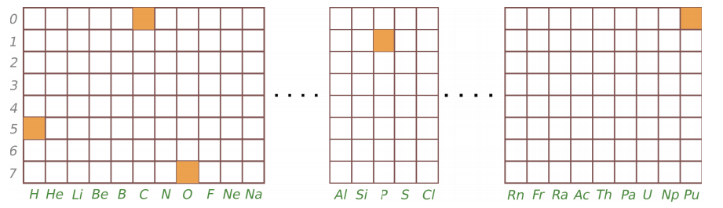
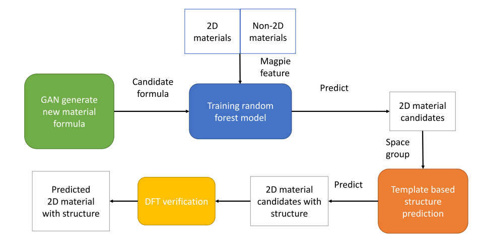
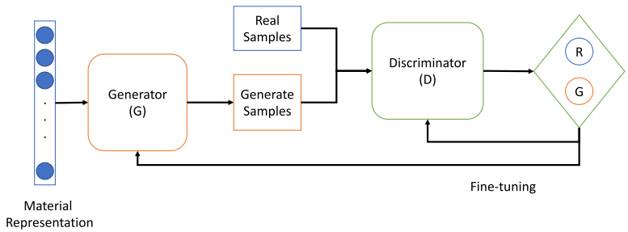
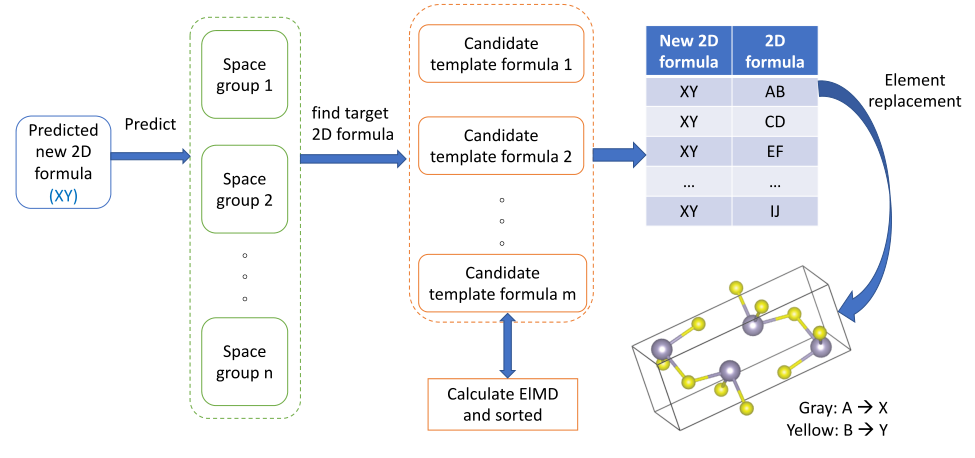
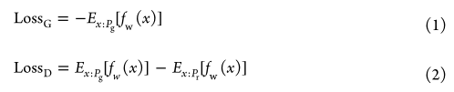

# Computational Discovery of New 2D Materials Using Deep Learning Generative Models

​	提出了一个结合随机森林的深度生成模型来生成和分类2D材料，并提出了一个基于模板的结构预测程序从化学式预测晶体结构，使用DFT计算进行验证。发现了267489种可能的2D材料化学式，其中1485种有95%的可能是2D材料。最后是预测了101种晶体的结构，使用DFT计算验证了92种2D结构。整体流程如下：

## 数据及处理

### 数据来源

​	数据主要来自2D材料数据库2dMaterials和Material Project，ICSD_2M是使用MatGAN生成的新的化学式

### 特征构建

​	本文和MatGAN类似，也是将化学式编码为了One-hot向量（8x85），如下所示

## 模型

​	整体的模型如下所示，使用如下步骤：

* 使用MatGAN生成新的化学式（2百万个），检查它们的电荷中性和电负性
* 使用随机森林分类器分类2D材料和非2D材料化学式，使用Roost预测它们的形成能，选择好的
* 使用基于模板的方法预测生成的2D材料的结构（从化学式）
* 使用DFT计算验证

### 生成对抗模型

​	此模型和MatGAN中的模型一样。在生成新的化学式后，作者随后通过Semiconducting Materials from Analogy and Chemical Theory (SMACT)工具检查了这些材料的电荷中性和电负性平衡标准。

### 基于成分的预测2D材料的分类器

​	将化学式编码为Magpie特征，使用10折交叉验证训练一个随机森林模型，将2D和非2D材料的化学式作为输入，输出分类的结果和分数。树的最大深度（max_depth）设为20，树的数量（n_estimators）设为250。

### 基于模板的结构预测

​	整体结构如下所示。

​	首先使用晶体结构预测网络（CRYSPNet）从化学式预测了其可能对应的空间群。随后使用Element Movers Distance (ElMD)机器学习模型找到其最相近的模板。最后使用前10个最接近的结构，通过替换元素来生成新结构。

### DFT计算验证

​	基于VASP，基于公式3计算了每个原子的形成能（Formation energy），基于公式4计算了脱离能（Exfoliation energies）

