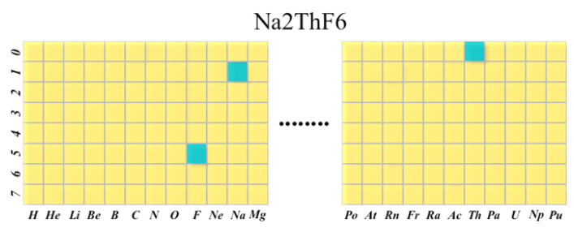

# Active-Learning-Based Generative Design for the Discovery of Wide Band-Gap Materials

​	将主动学习与深度自编码器神经网络和生成对抗神经网络模型结合，在整个化学设计空间中发现具有高带隙的新的热力学稳定材料（$SrYF_5$）和具有指定带隙范围的半导体（$SrClF_3,CaClF_5,YCl_3,SrC_2F_3,AlSCl,As_2O_3$）。

## 数据集及处理

### 数据来源

​	从Material Project（MP）中获取了不重复的42667个带有带隙的样本数据。

### 特征构建

​	行是87种元素，按照元素周期表排列，列是元素个数。使用上述的one-hot对化学式进行编码

## 模型及细节

​	主要思想是使用主动学习方法来学习高精度的属性预测模型并将其与生成模型结合起来。由三个模块组成：

* 使用有限样本标记训练的高性能性能预测器的主动学习模型
* 一个获选化合物的生成模型
* 用于发现新材料的筛选模型

​	上述模型中有两种方法可以发现新材料：

* ALS：将主动学习和自编码器模型结合，在整个化学空间搜索
* AL+RF/Roost with MATGAN：基于MATGAN生成的获选化学式，使用主动学习标记数据，用于RF/Roost训练筛选模型

### Oracle Module

​	机器学习模型，使用整个数据集的材料特征和带隙标签进行训练，用于模拟DFT计算，从而输出标签。

​	模型输入是经过自动编码器编码后的潜在向量，而后使用Roost计算描述符，使用带有5个隐含层和ReLU作为激活函数的Resnet。

### 主动学习模块

​	主动探索整个设计空间，识别信息采样点，获取其属性标注，并将其输入，获取高精度的属性预测模型。过程如下：

* 将化学式通过自动编码器编码为128维潜在向量
* 将潜在变量和属性标注输入到高斯代理模型，获取基于不确定性的采样点建议
* 通过自动解码器生成化学式（有些可能还原不了）
* 输入到Orcale Module中，获取标记的数据

### 用于生成潜在空间的自动编码器

​	如上所示，此编码器使用构建的one-hot矩阵向量作为输入，而后使用两个卷积层和一个全连接层生成128维的潜在空间，而后使用一个全连接层和两个转置矩阵层进行还原。

​	使用ReLU作为激活函数（最后一层使用Sigmoid函数），使用Adam优化器，学习率设置为0.001，训练时使用了交叉熵损失，使用MP中的66324种无机材料进行了训练。

### 有效抽样的主动学习模块

​	使用贝叶斯优化（BO）作为主动学习抽样策略来探索的设计空间。就是理论上存在大量的元素组合，文中是使用这种方法选择化学式的

### 基于模块的结构预测和基于DFT的验证

​	说的是模型图右边一侧。在获取候选材料的化学式后，使用基于模板的程序对它们的晶体结构进行了预测，而后使用全局注意图神经网络（GATGNN）获取它们的形成能（检查电荷中性和电负性完整性），进行DFT计算验证

* 使用Earth Mover's Distance (EMD)来计算候选公式和数据库中所有化学式的相似性
* 根据EMD距离排序，将最相似公式的CIF文件标识为结构模板，用于元素替换，以生成候选组合的结构
* 新结构的CIF文件使用GATGNN预测形成能，能力为负的候选结构被留下
* 使用DFT计算验证

## 结果和讨论

​	使用MATGAN生成了1180000个潜在的材料组合，使用UCB效用函数的贝叶斯优化作为主动学习，k设为10。Roost模型基于原始和生成的数据训练。设计了如下的4个实验，每个实验重复10次，数据集被分为60%训练集，20%测试集以及20%验证集：

**Exp 1-oracle**：MP中42667种材料用于训练预测带隙的Oracle模型。该模型随后被用于从MATGAN中筛选高潜力带隙材料

**Exp 2**：从MP中选择1000个标记样本训练基线ML模型（Exp2 BS）。使用高斯代理模型进行主动学习，在贝叶斯优化器下采样1000个采样点，741个可被解码为有效成分。使用有效成分和1000个标记训练样本训练一个更新的筛选模型（Exp 2 AL）。随后使用这两个模型对生成的材料进行筛选，比较性能。

**Exp 3**：随机从MP中选择300个样本训练进行基线ML模型训练和高斯过程初始化。使用主动学习生成1000个新样本，得到853个有效成分，将共1153个样本训练更新后的ML模型（Exp 3 AL）,随后用这两个模型对生成的材进行筛选，比较性能

**Exp 4**：只选择300个带隙值低于$3.0\quad eV$的样本进行主动学习

### 四个实验性能

