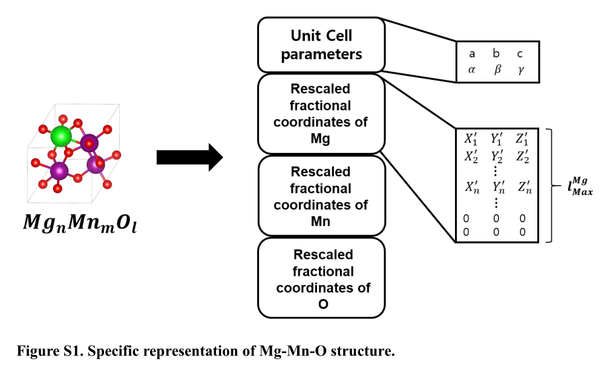
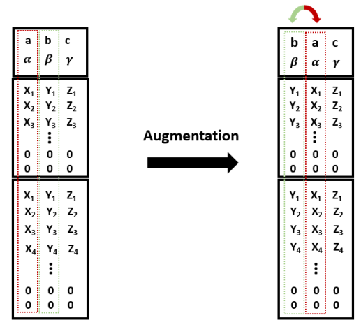
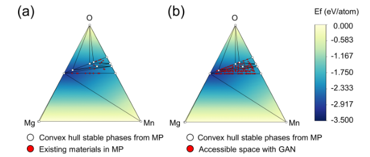

# Generative Adversarial Networks for Crystal Structure Prediction

​	本文使用GAN生成了Mg-Mn-O三元材料的结构，而后使用高通量虚拟筛选（HTVS）对这些材料的光阳级性进行了评价，找出了14种新成分。

## 数据集及处理

### 数据来源

​	从Material Project中构建Mg-Mn-O体系的数据库，去除重复后，保留了112种独特的成分和1240个独特的结构。而后，对每种组合使用数据增强技术，直到这些组合的每种结构达到1000种。由此，可以产生112000个Mg-Mn-O结构。

### 特征构建

上图中的$a、b、c、\alpha、\beta、\gamma$是晶胞常数，右下的矩阵是经过缩放和归一化的矩阵。

* $l^{Mg}_{Max}$表示表示Mg坐标的最大行数，取在化学式中可能达到的最大元素个数，在表示时空出的行会被0填充。在Mg-Mn-O体系中，$l^{Mg}_{Max}$是8，$l^{Mn}_{Max}$是8，$l^{O}_{Max}$是12

* 为区分位于(0,0,0)的真实原子与用于固定形状的零填充，使用如下方法重新缩放了分数坐标：

  * 对于任意一点$P(X,Y,Z)$，会被缩放为：

    $P'=\frac{2}{3}[P-(0.5,0.5,0.5)]+(0.5,0.5,0.5)$

### 数据增强

* 超晶胞操作——在x-y轴、y-z轴和x-z轴上分别重复两次单位晶胞来制作超晶胞，其中的原子数不超过我们表示的最大原子数

* 平移操作——对结构数据进行平移运算，将单位胞内原子按小于胞长的随机距离移动

* 旋转操作——交换两个轴（列）对结构数据进行旋转操作

## 模型及细节

​	上述的GAN模型包含三个组件：生成器、评论器和分类器。生成器以随机高斯噪声向量（Z）和one-hot编码合成向量（$C_{gen}$）作为输入，生成新的2d表示。评价器通过计算Wasserstein距离来进行优化。	

​	在生成新材料时使用上面的结构进行生成。

### 模型架构

* 符号定义

* 生成器

  使用ReLU作为激活函数，一个全连接层+三个转置卷积和BatchNorm层+一个转置卷积层从而生成坐标，再在上面使用展平层+全连接层+BatchNorm层+全连接层+sigmoid生成晶胞常数

​	

* 评价器

  使用Leaky-ReLU作为激活函数，三个卷积层->合并处理+一个展平及全连接层+两个全连接层

  

* 分类器

  使用Leaky-ReLU作为激活函数，4个卷积BatchNorm层

  * 加上一个Softmax层生成判定结果
  * 加上展平层+2个全连接BatchNorm层+全连接Softmax层生成成分

### 超参数

### 损失函数

​	本文使用WGAN中所提出的损失函数，它解决了原始GAN中的训练的不稳定和模式崩溃等问题。其定义如下：

$D$是惩罚函数，$P_{\hat{x}}$是真实数据分布中采样的点对之间的直线均匀抽样，$P_r$和$P_g$分别是真实分布和生成器的分布，$\lambda$是惩罚系数，设为10。为了训练生成器创建具有目标属性的材料，生成器与带有损失函数的分类器一起训练：

其中，CE是交叉熵损失，$x_i$是分类器函数输出的第i个值，C是类别数量，$t_i$是第i个目标值

| $C_{real}$       | $\hat{C}_{real}$ | $C_{gen}$        | $\hat{C_{gen}}$  |
| ---------------- | ---------------- | ---------------- | ---------------- |
| 真实材料的真实值 | 真实材料的预测值 | 生成材料的真实值 | 生成材料的预测值 |

$\lambda_1,\lambda_2和\lambda_3$分别是成分生成器、原子状态和成分系数中的参数

### 学习曲线

对于一种材料，通过分析它的晶体结构文件从而生成关于晶胞常数（长度和角度）和原子坐标（缩放后）的相关信息，如上图所示。

本文使用生成对抗模型生成了Mg-Mn-O三元材料，并使用高通量虚拟筛选（HTVS）对这些材料的光阳极性进行了评价。提出的HTVS框架预测了23种具有合理计算稳定性和带隙的新晶体结构。

​	HTVS常被用来从数据库中筛选具有前途的材料，目前的搜索是通过对晶体结构中的元素进行组合替换，然后筛选。但这种方法不能超越数据库中现有晶体结构的模板。

​	生成模型则侧重于构建一个连续的材料向量空间，在化学领域，常使用变分自编码器（VAE）和生成对抗模型（GAN）。

​	最早提出的编码晶体结构的表示方法之一是3d图像表示，但这种方法需要占据大量空间且训练时间慢。

## 结果和讨论

### 与iMatGen的对比

作者使用V-O体系分别在本文所提出的架构和iMatGen上进行了结构生成，然后对比了两者的效果：

* iMatGen发现的V-O亚稳态多态（$E_{hull}\le200 \quad meV/atom$）中40%被当前GAN模型重新发现，剩余60%的差异可以解释为每个生成模型中潜在空间结构或采样方法的差异
* 在$V_3O_4$和$V_6O_7$中，本文的GAN模型生成的结构更加稳定

### 三元Mg-Mn-O光阳极材料的生成式高通量筛选

* 设定Mn氧化态条件（$2\le OS_{Mn}\le 4$），从已有材料的化学空间（下图(a)）展开，由此得到133种满足条件的候选成分(下图(b))

* 考虑到单位细胞中的原子数以及DFT计算成本，从113种材料中选择了31种化合物（11种在MP中（下图(c)），20种不在MP中(下图(d))）

* 使用图3过程进行采样，从11种在MP中的材料生成了3300种结构（上图(c)）（包括在MP中已有的300种结构），从20种不在MP中的材料生成了6000种结构（上图(d)）（不包括在MP中已有的300种结构）

* 性能评估

  * 上图（c）中，在MP中现有成分的3300种新生成的结构种，亚稳定的新的结构（$E_{hull}\le 200\quad meV/atom$）有368种（红色叉）。图c中35种已有的结构被认为是可以合成的（$E_{hull}\le 80\quad meV/atom$）。新生成的368种结构中，有60种和之前HTVS的结果类似。值得注意的是，$MgMn_4O_8$的结果非常接近凸包（$E_{hull}=5\quad meV/atom$），比MP中发现的所有相关多态都稳定得多
  * 上图（d）中，753种结构被预测为理论上亚稳的（$E_{hull}\le 200\quad meV/atom，红色叉$），其中113种结构被认为是潜在可合成的（$E_{hull}\le 80\quad meV/atom$）。对于$Mg_2MnO_4$这种不在MP中的成分，发现了一个对应于凸包最小值的结构。

* 光阳极材料——从$E_{hull}\le 80\quad meV/atom$(c中的35种材料和d中的113种材料)的材料中测定Pourbaix稳定性（$\Delta G_{pbx}$）和带隙（$E^{HSE}_g$）进行筛选

  * Pourbaix hull表示在给定PH和电化学条件下的水电环境中的稳定性（即基态和自由能的差值）
  * 使用Pymatgen包进行计算，设定PH为0-14，1.5V vsRHE时Pourbaix hull Gibbls的最小自由能$\Delta G^{min}_{pbx}$，对$\Delta G^{min}_{pbx}(E_{form})\le0.8\quad eV/atom$，继续进行HSE计算以计算带隙
  * 通过设定$\Delta G^{min}_{pbx}(E_{form})\le0.59\quad eV/atom$，以及$1.6\quad eV\le E^{HSE}_g\le 3.0eV$，选出了28种潜在的阳性材料，其中14种材料是在数据库中未包含的新成分

  

