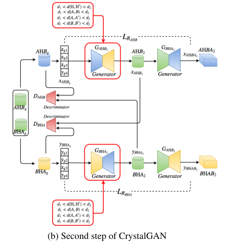

# CrystalGAN: Learning to Discover Crystallographic Structures with Generative Adversarial Networks

​	本模型使用如下的三个步骤来从已知的两个域（二元化合物AH和BH）生成新的域（三元化合物AHB或BHA）

* 使用和跨域GANs类型的方法生成混合域的伪二进制样本
* 转移过程从前一步生成的样本中构造更高阶的复杂度数据
* 第二步GAN合成，再几何约束下，生成新型的三元稳定化学结构

## 第一步

​	模型分别将AH和BH（A是一种金属，B是另一种金属）经过编码后的向量数据作为输入。经过一个生成器生成一个潜在空间，第二个生成器作为翻译器，然后计算$AH$和$AHBA_1$之间的损失，损失越小，说明两个生成器越好。

​	若将输入分别记为$\{(x_{AH_i})\}^{N_{AH}}_{i=1}$以及$\{(y_{BH_i})\}^{N_{BH}}_{i=1}$，则可得到如下等式：

$x_{AHB_1}=G_{AHB_1}(x_{AH})\quad\quad x_{AHBA_1}=G_{BHA_1}(x_{AHB_1})=G_{BHA_1}\cdot G_{AHB_1}(x_{AH})$

$y_{BHA_1}=G_{BHA_1}(y_{BH})\quad\quad y_{BHAB_1}=G_{AHB_1}(y_{BHA_1})=G_{AHB_1}\cdot G_{BHA_1}(y_{BH})$

​	**重建的损失函数可定义（即计算原始数据和重建数据之间的距离）如下**

$L_{R_{AH}}=d(x_{AHBA_1},x_{AH})=d(G_{BHA_1}\cdot G_{AHB_1}(x_{AH}),x_{AH})$

$L_{R_{BH}}=d(y_{BHAB_1},y_{BH})=d(G_{AHB_1}\cdot G_{BHA_1}(y_{BH}),y_{BH})$ 

在理想情况下，$L_{R_{AH}}=0,L_{R_{BH}}=0,x_{AHBA_1}=x_{AH},y_{BHAB_1}=y_{BH}$

​	**生成器的任务是保证原始数据尽可能精确地重建，故先定义如下损失**

$L_{GAN_{BH}}=-E_{x_{AH}\sim P_{AH}}[log(D_{BH}(G_{AHB_1}(x_{AH})))]$

$L_{GAN_{AH}}=-E_{y_{BH}\sim P_{BH}}[log(D_{AH}(G_{BHA_1}(x_{BH})))]$

​	**则生成器$G_{AHB_1}$（左上和右下）以及生成器$G_{BHA_1}$（右上和左下）的损失函数可定义如下：**

$L_{GAN_{AHB_1}}=L_{GAN_{BH}}+L_{R_{AH}}\quad\quad L_{GAN_{BHA_1}}=L_{GAN_{AH}}+L_{R_{BH}}$

​	**则生成器的总损失可定义为：**

$L_{G_1}=L_{G_{AHB_1}}+L_{G_{BHA_1}}=\lambda_1L_{GAN_{BH}}+\lambda_2L_{R_{AH}}+\lambda_3L_{GAN_{AH}}+\lambda_4L_{R_{BH}}$

​	**判别器AH和BH的损失函数可定义如下：**

$L_{D_{BH}}=-E_{y_{BH}\sim P_{BH}}[log(D_{BH}(y_{BH}))]-E_{x_{AH}\sim P_{AH}}[log(1-D_{BH}(G_{AHB_1}(x_{AH})))]$

$L_{D_{AH}}=-E_{x_{AH}\sim P_{AH}}[log(D_{AH}(x_{AH}))]-E_{y_{BH}\sim P_{BH}}[log(1-D_{AH}(G_{BHA_1}(y_{BH})))]$

​	**则判别器的总损失可定义为：**

$L_{D_1}=L_{D_{AH}}+L_{D_{BH}}$

## 第二步（特征转移）

​	在第一步中生成的$x_{ABH_1}$和$y_{BHA_1}$是融合A和B属性的新域，但域A和域B在这些样本中完全混合，没有办法推导出来自这些域的两个独立元素的特征。

​	所以作者添加了一个占位符（对于AH域，第四个矩阵为空，对于BH域，第三个矩阵为空）。而后将当前域为空的位置替换为另一个域对应位置的矩阵元素，然后会生成如第一步的$ABH_g$和$BAH_g$

## 第三步

​	在这一步中，作者考虑了晶体结构的几何约束来控制生成数据的质量。具体原理是：晶体结构完全由局部分布来描述，这种分布是由给定晶体结构中每个原子到所有最近邻的距离决定的。

​	若假定$S=\{s_i\}^m_{i=1}$分别是一个晶体结构中所有原子的最近邻，$d_1$是两个最近邻点之间的最短距离，$d_2$是两个最近邻点之间的最远距离，则可定义如下两个几何约束：

$L_{geo_1}=f(d_1,s_1,...,s_m)=min_{s\in S}||d_1-s||^2_2$

$L_{geo_2}=f(d_2,s_1,...,s_m)=-min_{s\in S}||d_2-s||^2_2$

​	**总的几何约束可定义如下：**

$L_{geo}=L_{geo_1}+L_{geo_2}$

​	**剩余的损失函数定义同第一步类似，给定$x_{AHB_g}$以及$y_{BHA_g}$，则可得到如下等式：**

$x_{AHB_2}=G_{AHB_2}(x_{AHB_g})\quad\quad x_{AHBA_2}=G_{BHA_2}(x_{AHB_2})=G_{BHA_2}\cdot G_{AHB_2}(x_{AHB_g})$

$y_{BHA_2}=G_{BHA_2}(y_{BHA_g})\quad\quad y_{BHAB_2}=G_{AHB_2}(y_{BHA_2})=G_{AHB_2}\cdot G_{BHA_2}(y_{BHA_g})$

​	**重建的损失函数可定义（即计算原始数据和重建数据之间的距离）如下**

$L_{R_{AHB}}=d(x_{AHBA_2},x_{AHB_g})=d(G_{BHA_2}\cdot G_{AHB_2}(x_{AHB_g}),x_{AHB_g})$

$L_{R_{BHA}}=d(y_{BHAB_2},y_{BHA_g})=d(G_{AHB_2}\cdot G_{BHA_2}(y_{BHA_g}),y_{BHA_g})$ 

**生成器的任务是保证原始数据尽可能精确地重建，故先定义如下损失**

$L_{GAN_{BHA_g}}=-E_{x_{AHB_g}\sim P_{AHB_g}}[log(D_{BHA}(G_{AHB_2}(x_{AHB_g})))]$

$L_{GAN_{AHB_g}}=-E_{y_{BHA_g}\sim P_{BHA_g}}[log(D_{AHB}(G_{BHA_2}(x_{BHA_g})))]$

​	**则生成器$G_{AHB_2}$（左上和右下）以及生成器$G_{BHA_2}$（右上和左下）的损失函数可定义如下：**

$L_{GAN_{AHB_2}}=L_{GAN_{BHA_g}}+L_{R_{AHB}}\quad\quad L_{GAN_{BHA_2}}=L_{GAN_{AHB_g}}+L_{R_{BHA}}$

​	**则生成器的总损失可定义为：**

$L_{G_2}=L_{G_{AHB_2}}+L_{G_{BHA_2}}+L_{geo}=\lambda_1L_{GAN_{BHA_g}}+\lambda_2L_{R_{AHB}}+\lambda_3L_{GAN_{AHB_g}}+\lambda_4L_{R_{BHA}}+\lambda_5L_{geo_1}+\lambda_6L_{geo_2}$

​	**判别器AHB和BHA的损失函数可定义如下：**

$L_{D_{BHA}}=-E_{y_{BHA_g}\sim P_{BHA_g}}[log(D_{BHA}(y_{BHA_g}))]-E_{x_{AHB_g}\sim P_{AHB_g}}[log(1-D_{BHA}(G_{AHB_2}(x_{AHB_g})))]$

$L_{D_{AHA}}=-E_{x_{AHB_g}\sim P_{AHB_g}}[log(D_{AHB}(x_{AHB_g}))]-E_{y_{BHA_g}\sim P_{BHA_g}}[log(1-D_{AHB}(G_{BHA_2}(y_{BHA_g})))]$

​	**则判别器的总损失可定义为：**

$L_{D_2}=L_{D_{AHB}}+L_{D_{BHA}}$

## 结构和结果

**输入输出维度及结构**

​	以生成器$G_{AHB_1}$为例，其输入输出为：$\R^{l\times m}_{AH},\R^{l\times m}_{BH}\rightarrow\R^{k\times m}_{AHB_1}$

​	以判别器$D_{AH}$为例，其输入输出为：$\R^{k\times m}_{AHB_1}\rightarrow[0,1]$

​	生成器和判别器的定义都类似，都是使用5到10层的全连接层，只不过判别器最后用了一个sigmoid层用来预测标签

**特征构建和特征维度**

​	根据晶体结构文件POSCAR提供的晶胞常数和原子坐标来构建特征如下图所示，并且从每个体系（域）中，选择个晶体结构（稳定和亚稳态）

​	由此可得到如下的特征维度（18和3分别是每个在上面的每个矩阵中最大行数和最大列数）

**实现细节**

​	在生成晶体结构时，规定的是$A-B,A-A'和B-B'$之间的距离，而$A-H$和$B-H$之间的距离不受限制。在这篇文章中，$d_1=1.8A^。,d_2=3A^。$，通过交叉验证设置超参数。使用AdamOptimizer作为优化器，并设置$\alpha=0.0001,\beta_1=0.5$。将epochs设置为1000，并将min-batch设置为35(因为一个Input维度就是35)。每个生成器或判别器都是5层的多层神经网络，而且每层有100个单元，并且使用ReLU作为激活函数。

**结果**

​	GAN的潜在空间使用高斯噪声作为输入，无法生成可接受的化学结构。若使用DiscoGAN来生成新的伪二元结构，则它表现得非常好，但不适合生成三元结构。带约束的CrystalGAN优于所有其他结果

​	下图是生成的Pd-Ni-H，作者想说明的是，所有原子之间的最短距离都满足要求，即生成的结构尊重几何结构

