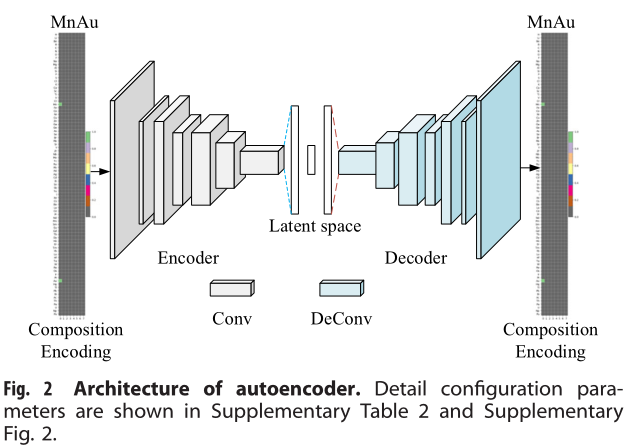

# Generative adversarial networks (GAN) based effificient sampling of chemical composition space for inverse design of inorganic materials

​	提出了一个生成对抗模型（GANs），能够从已知材料的化学式中学习到隐含的化学成分规则，以生成假设的但化学上合理的化合物。

## 数据集及处理

### 数据来源

​	作者主要使用的数据集是来自OQMD，对于报道了多种形成能的化学式，我们保留形成能最低的那一个以选择最稳定的结构。单个元素化合物和形成能不在$\{u-5\delta,u+5\delta\}$中的元素被去除，其中$u$和$\delta$是所有样本形成能得平均值和标准差。由此得到了291884个化合物。

​	作为对比，作者还使用了MP和ICSD数据库，去除了其中所有单原子化合物，单个元素个数超过8个的化合物以及含Kr和He元素的化合物，最终从MP中得到了63922个化合物，从ICSD中得到了28137个化合物。

### 特征构建

​	从OQMD数据库中搜寻材料的化学式，经统计得到共有85种材料，每种材料最多包含8种单个元素，因此采用如下的类似one-hot编码形式（8x85），其中横轴是按元素周期表排列的，纵轴是从0到7排列的

## 模型及细节

​	作者使用如下的GAN模型来生成新的化学式，该模型包含一个生成器和一个判别器。生成器使用转置卷积来生成假样本，判别器通过分辨真假样本来反馈给生成器从而达到更好精度。为避免GANs的梯度消失问题，作者使用了Wasserstein距离（CompCondCrystalGAN中也使用了这个）,其定义如下：
$$
Loss_G=-E_{x:P_g}[f_w(x)]\\
Loss_D=E_{x:P_g}[f_w(x)]-E_{x:P_r}[f_w(x)]
$$
其中，$P_g$和$P_r$分别是生成样本和正式样本的分布，$f_w(x)$是判别器

​	但作者发现，使用上述方法很难生成特定类型的样本。所以后面他们使用了如下的变分自动编码器来生成Latent space。该模型使用了医学中常用的negative dice coefficient函数作为损失函数，使用反向传播训练AE模型。损失函数定义如下：
$$
Loss_{AE}=-Dice=-\frac{2|A\cap B|}{|A|+|B|}\approx \frac{2\times A\cdot B}{Sum(A)+Sum(B)}
$$
其中，$A\cap B$表示A和B的共同元素，$|g|$表示矩阵中元素的数量，$\cdot$表示点积，$Sum(g)$表示矩阵元素的数量。

​	AE模型的解码器和MatGAN模型中的生成器具有相同的结构。这样的话，若训练过的AE模型不能解码特定的材料，那么GAN模型就不太可能生成它。

### 模型细节

### 超参数设定

​	优化了用于训练GAN的超参数，将学习率从0.1设置为$10^{-6}$（每次减少10倍），将批归一化大小从32设置为1024，并使用不同的优化器。在生成的数据库上，作者使用了1000epochs、Adam优化器并设置生成器的学习率为0.001，设置判别器的学习率为0.01，在OQMDGAN上的batch size设为了512，其他几种GAN的batch size设置为了32。AE模型学习率设置为了$10^{-3}$，batch size设为了1024。

## 结果和讨论

### 生成材料性能验证

​	首先使用训练好的生成器生成了200万个假设材料，过滤掉了不满足电荷中性和平衡电负性的样本，最终生成了169万种材料，并使用了T-sne降维技术来观察生成材料的分布情况。

#### 有效性检查

​	电荷中性和电负性平衡是晶体的两个基本化学规律，作者使用[论文中](https://www.sciencedirect.com/science/article/pii/S2451929416301553)提出的检查程序来计算生成材料的电荷中性和电负性。

​	通过测定材料的形成能可以检查他们的稳定性，作者从200万中材料中选择了含锂元素的材料，而后过滤掉不满足电荷中性和电负性的材料，而后使用预测形成能的[ElemNet](https://www.nature.com/articles/s41467-018-06322-x)来预测它们的形成能。

#### 带隙检查

​	作者从MP数据库中收集了30186种带隙大于0的材料，而后使用论文中的[GBRT模型](https://www.nature.com/articles/npjcompumats201628)进行训练，由此来预测新材料的带隙

